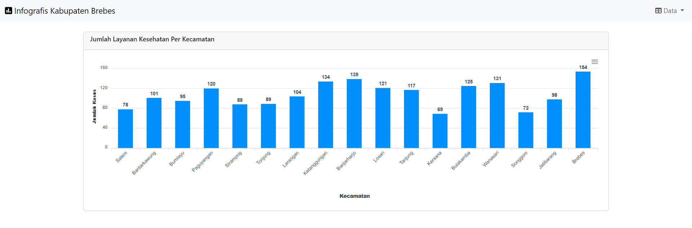

<h2>SIGIBU BREBES: Sistem Informasi Gizi Buruk Anak Kabupaten Brebes</h2>
<h4>Produk: [Website SIGIBU BREBES](https://salsabilaeka.github.io/pgweb-responsi/)<h4>
<h4>Produk: <a href="https://salsabilaeka.github.io/pgweb-responsi/">Website SIGIBU BREBRES</a></h4>
<h4>Deskripsi produk</h4>

Berdasarkan Survei Status Gizi Indonesia (SSGI), Kabupaten Brebes menjadi wilayah dengan prevalensi anak kekurangan gizi tertinggi di Jawa Tengah mencapai 29,1%. Angka ini meningkat 2,8% dari tahun sebelumnya. WebGIS ini memberikan informasi terkait tingkat gizi buruk anak setiap kecamatan di Kabupaten Brebes dan titik pesebaran layanan kesehatan yang dapat digunakan masyarakat untuk memeriksa, mengobati, dan mencegah terjadinya gizi buruk anak.

<h4> Komponen pembangun produk </h4>
<ol>
  <li>HTML : Sebagai kerangka dasar dalam pembuatan stuktur dan isi konten WebGIS.</li>
  <li>CSS : Mengatur tata letak dan tampilan dari WebGIS</li>
  <li>PHP : Membuat WebGIS lebih dinamis dan interaktif serta dapat berinteraksi dengan database MySQL</li>
  <li>Leaflet.js : Library JavaScript yang digunakan menampilkan peta interaktif, mendukung marker, pop up, plugins, dan sebagainya</li>
  <li>Bootstrap : Library CSS yang digunakan untuk mengatur tampilan dari user interface WebGIS</li>
  <li>ApexCharts : Library yang digunakan untuk membuat diagram pada data statistik.</li>
  <li>Geoserver : Server GIS yang digunakan untuk membagi, menyimpan, dan mengelola data geografis dari berbagai sumber, seperti dari database PostGIS.</li>
  <li>MySQL: Menyimpan data titik persebaran layanan kesehatan posyandu, puskesmas, dan rumah sakit di Kabupaten Brebes dan menampilkannya dalam bentuk marker</li>
  <li>XAMPP : Server web lokal yang digunakan untuk mengembangkan dan menguji web yang dibuat pada Visual Studio Code.</li>
</ol>

<h4>Sumber Data:</h4>
<ol>
  <li>Kabupaten Brebes dalam Angka 2022 dari Badan Pusat Statistik: <a href="https://brebeskab.bps.go.id/publication/2022/02/25/cdf2ed2faf9964186b9b4cd8/kabupaten-brebes-dalam-angka-2022.html">Data Statistik 2022</a></li>
  <li>Kabupaten Brebes dalam Angka 2021 dari Badan Pusat Statistik: <a href="https://brebeskab.bps.go.id/publication/2021/02/26/790b62ca1dad3d9c6f697106/kabupaten-brebes-dalam-angka-2021.html">Data Statistik 2021</a></li>
  <li>Kabupaten Brebes dalam Angka 2019 dari Badan Pusat Statistik: <a href="https://brebeskab.bps.go.id/publication/2019/08/16/eb73c73f3fff36fd60493a19/kabupaten-brebes-dalam-angka-2019.html">Data Statistik 2019</a></li>
  <li>Kabupaten Brebes dalam Angka 2018 dari Badan Pusat Statistik: <a href="https://brebeskab.bps.go.id/publication/2018/08/16/2d41aaf02698ce497f2eaff4/kabupaten-brebes-dalam-angka-2018.html">Data Statistik 2018</a></li>
  <li>Data Shapefile Administrasi Kabupaten Brebes dari <a href="https://tanahair.indonesia.go.id/portal-web/">Ina Geoportal</a></li>
  <li>Data Koordinat Titik Lokasi Layanan Kesehatan (Posyandu, Puskesmas, dan Rumah Sakit) di Kabupaten Brebes yang diambil dari Google Maps</li>
</ol>

<h4>Tangkapan Layar Komponen Penting</h4>
<ol>
  <li>Landing Page</li>    
  <li>Peta Tingkat Gizi Buruk (data diambil dari geoserver)</li> 
  <li>Peta Persebaran Layanan Kesehatan (data diambil dari database)</li> 
  <li>Data statistik</li>   
  <li>Form Input Pengguna WebGIS (data akan tersimpan pada database MySQL) </li>
</ol>
